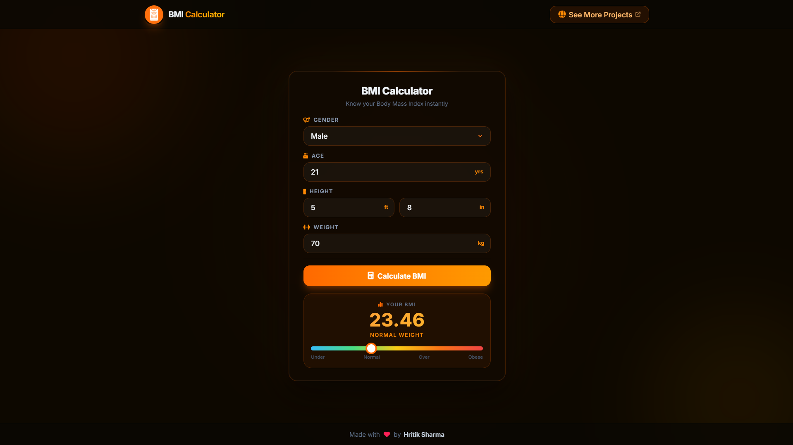

# BMI Calculator

A modern, dark-themed, and fully responsive BMI (Body Mass Index) Calculator built with HTML, Tailwind CSS, and Vanilla JavaScript. It allows users to quickly calculate their BMI by entering their gender, age, height (in feet and inches), and weight (in kg).

## Preview



## Tech Stack


## Features

- **Modern Glassmorphism UI:** A sleek, dark-themed interface with vibrant orange/amber accents.
- **Dynamic Scale Bar:** Visual representation of where the calculated BMI falls on the health scale.
- **Fully Responsive:** Looks great on desktop, tablet, and mobile devices.
- **Input Validation:** Ensures all fields are filled out correctly before calculation.

## Future Scope - What I'd improve

- 📊 BMI history (using localStorage)
- 📄 Download PDF report
- 📱 Metric ↔ Imperial unit switch
- 🌙 Dark/Light mode
- 📈 BMI trends chart
- 💧 Daily water intake estimate
- 🔥 Estimated daily calorie needs (BMR/TDEE)
- 🏃 Recommended exercise level
- ❤️ Waist-to-height ratio calculator
- 🧮 Body fat estimator (using BMI + age + gender)


## 🚀 Getting Started

### Prerequisites
- [Node.js](https://nodejs.org/) (version 18 or higher recommended)

### 1. Clone the repository
```bash
git clone https://github.com/hritik2004-cse/BMI_Calculator.git
cd BMI_Calculator
```

### 2. Install dependencies
```bash
npm install
```

### 3. Start the development server
```bash
npm run dev
# → Vite dev server will start (usually on http://localhost:5173)
```

## 📂 Project Structure

```text
BMI_Calculator/
├── src/
│   ├── assets/         # Images, icons, and static assets
│   ├── main.js         # Core application logic and DOM manipulation
│   └── style.css       # Tailwind entry point and custom CSS animations
├── index.html          # Main HTML structure and UI components
├── package.json        # Project metadata and npm scripts
├── vite.config.js      # Vite and Tailwind CSS v4 configuration
└── README.md           # Project documentation
```

## 🎨 Design Language

| Element | Style |
| --- | --- |
| **Background** | Warm dark space (`#0d0800`) |
| **Cards & Nav** | Glassmorphism (`rgba(18,10,2,0.75)`) with blur filters |
| **Accents** | Vibrant Orange to Amber gradients (`#f97316` → `#fbbf24`) |
| **Glow Effects** | Subtle radial orbs and drop shadows (Tailwind shadow utilities) |
| **Typography** | Modern sans-serif (**Inter**) with bold, tracking-tight headings |

## 👤 Author

**Hritik Sharma**

Built with 🧡 — BMI Calculator is a showcase of modern UI/UX design and responsive web development.
